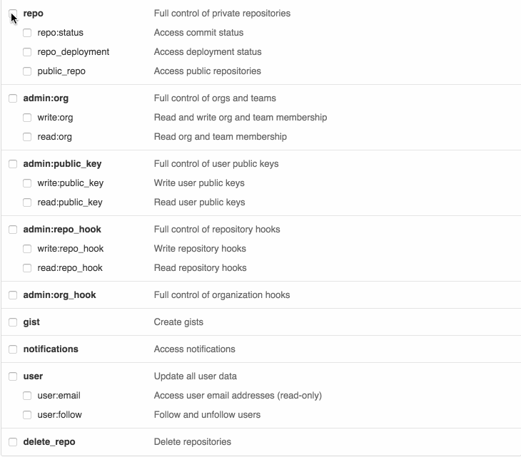

# Github Stats

[](https://sonarcloud.io/summary/new_code?id=IanStory99_github-stats)
[](https://www.codefactor.io/repository/github/ianstory99/github-stats)

## Requisitos

- [Node 18.12.0](https://nodejs.org/en/blog/release/v18.12.0/)

## Uso

- Crear archivo ".env" tomando como base al de ejemplo `.env.example` y completar los datos de autenticación de Github. [`Ver Token de Autenticación de Github`](#crea-un-token-de-autenticación-de-github)
- Ejecutar los siguientes comandos de inicializacion

```bash
    $ npm install
    $ npm run init
```

- Ejecutar el comando deseado. Los comandos pueden ser:

  - `organization` => Obtiene las estadísticas de una organización, sus equipos e integrantes.

    ```bash
    $ npm run cli -- organization --name=<nombre de la organización> --startDate=<fecha inicio> --endDate=<fecha fin> --savePath=<ruta de guardado>
    ```

  - `organization-team` => Obtiene las estadísticas de un equipo de una organización y sus integrantes
    ```bash
    $ npm run cli -- organization-team --name=<nombre de la organización> --team=<nombre del equipo> --startDate=<fecha inicio> --endDate=<fecha fin> --savePath=<ruta de guardado>
    ```
    - En caso de no especificar `startDate` -> Se coge el ultimo mes hasta `endDate`
    - En caso de no especificar `endDate` -> Se coge el día de hoy
    - En caso de no especificar ninguna fecha -> Se cogen los datos del último mes a partir de hoy
    - En caso de no especificar `savePath` -> Se guarda el resultado en el directorio raíz del proyecto con el nombre `output.csv`

## Crea un Token de Autenticación de Github

1. Ir a settings
2. Developer tools
3. **Importante**: Habilitar los scopes del Token 
4. Generar Token
5. Añadirlo al dotenv con la key: `GRAPHQL_TOKEN=<ingrese su token aqui>`

[Documentación](https://docs.github.com/en/authentication/keeping-your-account-and-data-secure/creating-a-personal-access-token)

## Ejemplos de comandos:

- Búsqueda por organización:

```bash
$ npm run cli -- organization --name=upbirk-com --startDate=2021-01-01 --endDate=2021-12-31 --savePath=./data.csv
```

- Búsqueda por team:

```bash
$ npm run cli -- organization --name=upbirk-com team --team=dev-melon --startDate=2021-01-01 --endDate=2021-12-31 --savePath=./data.csv
```
